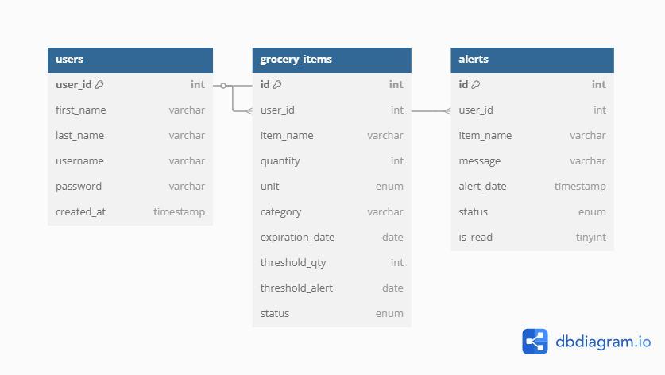

# Project Title
Smart Grocery Tracker

## Overview
Smart Grocery Tracker is a web application designed to help users efficiently track their grocery invetory.
Unlike traditional grocery list apps, this system automates inventory tracking by notifying users when items
are running low or have run out, and it automatically generates shopping lists based on real-time stock levels.

By reducing food waste and imporving shopping efficiency, this app provides a smarter alternative to manual tracking
methods, helping busy individuals and families stay organized effortlessly.

### Problem Space
Many people struggle with keeping track of their groceries, leading to food waste and missed essentials.

According to a study conducted by Second Harvest, over 46% of all food in Canada is wasted every year.
41% of this is avoidable with a value of $58 billion.
Source:https://www.secondharvest.ca/post/new-report-from-second-harvest-reveals-canadas-58-billion-food-waste-problem

Existing solutions rely on manual list-making or lack of automation, making grocery tracking inefficient.
Smart Grocery Tracker solves this by providing real-time inventory management, automated in-app alerts, and once-click
shopping list generation-- helping users save time, money and reduce waste.

### User Profile

Targeted Users:
Busy individuals, families, and anyone who wants to manage their pantry efficiently

Usage:
--> Users cans add groceries upon purchase, track usage patterns, and recieve alerts when stock is low
--> The system automatically generates a shopping list based on items that need restock
--> Users can categorize, search and organize groceries efficiently.

### Features
1. Automated Grocery Tracking:
i. Add, updated, and remove groceries in a structured inventory.
ii. Categorize groceries (e.g., dairy., vegetables, snacks) for better organization.

2. Smart Low-Stock Alerts:
In-App alerts/notifications when items are running low or have run out or expired.

3. One-Click Auto-Generated  Shopping Lists
i. Instantly generate a custom shoppong list based on low-stock items.
ii. Saves time by elimination manual list-making.

4. Search and Filters
i. Easily find specific items in your inventory
ii. Sort groceries by category and expiration date.

5. Mutli-Device Access
Responsive design to work on both mobile and desktop devices.

## Implementation

### Tech Stack
Frontend: React.js, JavaScript, HTML, CSS (Flexbox for layout)
Backend: Node.js, Express.js
Database: MySQL
Libraries/Tools: React Router, Axios, dotenv

### APIs

No external APIs will be used. All APIs will be custom built.

### Sitemap

List the pages of your app with brief descriptions. You can show this visually, or write it out.
1. Login Page
2. Sign-up Page
3. Home Page : Overview of groceries in inventory -- grocery tracker 
4. Shopping List Page: shopping tracker with list of items need to restock
5. Notifications Page: Displays alerts for low and expired items
6. User Preferences Page: Set threshold for qty alert and threshold for alert n days before expiry. Screen to prepopulate all items from home page

### Mockups
Please refer to Mockup.png image file

### Data

Database: smart_grocery_tracker

Table 1: users --> id, first_name, last_name, username, password, created_at
Table 2: grocery_items --> id, user_id, item_name, quanity, unit(kg, mg, g, ml, ltr, gallon, lbs, ct), category, expiration_date (optional), status (available, low, finished, expired),threshold for qty, threshold for alert , added_at, updated_at
Table 3: Alerts Table(Low stock/Finished item alerts) --> id, user_id, item_name, status (low, finished, expired), alert_date

### Endpoints

List endpoints that your server will implement, including HTTP methods, parameters, and example responses.

**Authentication API:**
i. POST api/register --> User registration

request body: 
{
    first_name: John
    last_name: Doe
    username: JDoe
    password: test123

}

response body:
HTTP 200 OK:
{
    id:1
    first_name: John
    last_name: Doe
    username: JDoe
    created_at: timestamp
}

HTTP 400: If the request does not meet requirements 

ii. POST api/login --> User login

request body:
{
    username: JDoe,
    password: test123
}

response body:

HTTP 200 OK:
{
    User logged in successfully!
}

HTTP 401: 
{
    Denied: Credentials do not match/user is not registered
}

**Grocery Tracker API:**
i. POST api/grocery/add --> Add new grocery items

request body:
{
    item_name: Apples,
    qty: 6 ct,
    category: fruits,
    status: available,
    expiration_date: //optional,
}

response body:

HTTP 200 OK
{
    item_name: Apples,
    qty: 6 ct,
    category: Fruits,
    status: Available,
    expiration_date: N/A
    added_at: timestamp
}

HTTP 400: Bad request

ii. GET api/grocery --> Get all grocery items

response body: HTTP 200 OK
[
    {
        id:1,
        user_id:1,
        item_name:Apples,
        quanity: 6ct,
        category: fruits, 
        expiration_date:N/A,
        status: available,
        added_at:timestamp
    },

    {
        id:2,
        user_id:1,
        item_name:Eggs,
        quantity: 5 ct,
        expiration_date: 15 Mar 2025,
        status: low,
        added_at: timestamp
    },

    {
    ...,
    },

     {
    ...,
    },
    
     {
    ...,
    },

]

iii. PUT api/grocery/update/:id --> Update grocery item quantity
request body:
{
    item_name: Apples,
    qty: 7 ct,
    category: fruits,
    status: available,
    expiration_date: //optional,
}

response body:

HTTP 200 OK
{
    id:1,
    user_id:1,
    item_name: Apples,
    qty: 7 ct,
    category: Fruits,
    status: Available,
    expiration_date: N/A
    added_at: timestamp
    updated_at: timestamp
}

HTTP 400: Bad request (If any of the mandatory fields are empty or values do not satisfy validation)

iv. DELETE api/shopping-list --> Clear shopping list from the page

request body:
{
    item_name: Apples,
    qty: 7 ct,
    category: fruits,
    status: available,
    expiration_date: //optional,
}

response body: 204 No Content

**Shopping List API**
i. GET api/shopping-list --> Generate a shopping list for low stock items or items having closer expiry date

response body: 
HTTP 200 OK
[
    {
        id:1,
        user_id:1,
        item_name:Apples,
        qty: 1 ct,
        status: low,
        created_at: timestamp of list generation
    },

    {
        id:2,
        user_id:1,
        item_name:Milk,
        qty: 1ltr,
        status: expired,
        created_at: timestamp of list generation
    },

    {
        ...,
    },

    {
        ...,
    },

]

ii. DELETE api/shopping-list --> Clear shopping list from the page

Request body:
[
    {
        id:1,
        user_id:1,
        item_name:Apples,
        qty: 1 ct,
        status: low,
        created_at: timestamp of list generation
    },

    {
        id:2,
        user_id:1,
        item_name:Milk,
        qty: 1ltr,
        status: expired,
        created_at: timestamp of list generation
    },

    {
        ...,
    },

    {
        ...,
    },

]

Response: 204 No Content

**Low Stock Alert API**
i. GET /alerts --> Get items that are running low or finished

Response body: HTTP 200 OK
[
    {
        id:1,
        user_id:1,
        item_name: Apples,
        status: low
    },

    {
        id:2,
        user_id:1,
        item_name:Milk,
        status: expired
    }
]

ii. DELETE /alerts/:id --> Delete an alert
Request body:
[
    {
        id:1,
        user_id:1,
        item_name: Apples,
        status: low
    }
]

Response: 204 No Content

Custom APIs (to be built):

Authentication API:
i. POST api/register --> User registration
ii. POST api/login --> User login

Grocery Tracker API
i. POST api/grocery/add --> Add new grocery items
ii. GET api/grocery --> Get all grocery items
iii. PUT api/grocery/update/:id --> Update grocery item quantity
iv. DELETE api/grocery/delete/:id --> Remove an item

Shopping List API
i. GET api/shopping-list --> Generate a shopping list for low stock items or items having closer expiry date
ii. DELETE api/shopping-list --> Clear shopping list from the page

Low Stock Alert API
i. GET /alerts --> Get items that are running low or finished
ii. DELETE /alerts/:id --> Delete an alert

## Roadmap

Sprint 1: 11 Mar 2025 - 14 Mar 2025
1. Setup Database
2. Build backed API (routes, controllers, index.js)
3. Gather assets (typography,images,icons, colors)
4. Setup basic routes in React

Sprint 2: 15 Mar 2025 - 20 Mar 2025
1. Setup Frontend - pages, components, app.jsx
2. Connect backend API to frontend
3. Styling and Visual Design

Testing and Bug fixes: 21 Mar 2025 - 22 Mar 2025
Capstone Project Submission: 23 Mar 2025

---

## Future Implementations
1. Integrate meal planning/recipie generation using external APIs.
2. Email notifications for low stock items (send list of low-stock items in a document at a time based on user preference).
3. Barcode snanner for adding groceries quickly.
4. Shared Family Accounts for collaborative grocery tracking.
5. Integration with online grocery delivery services.

